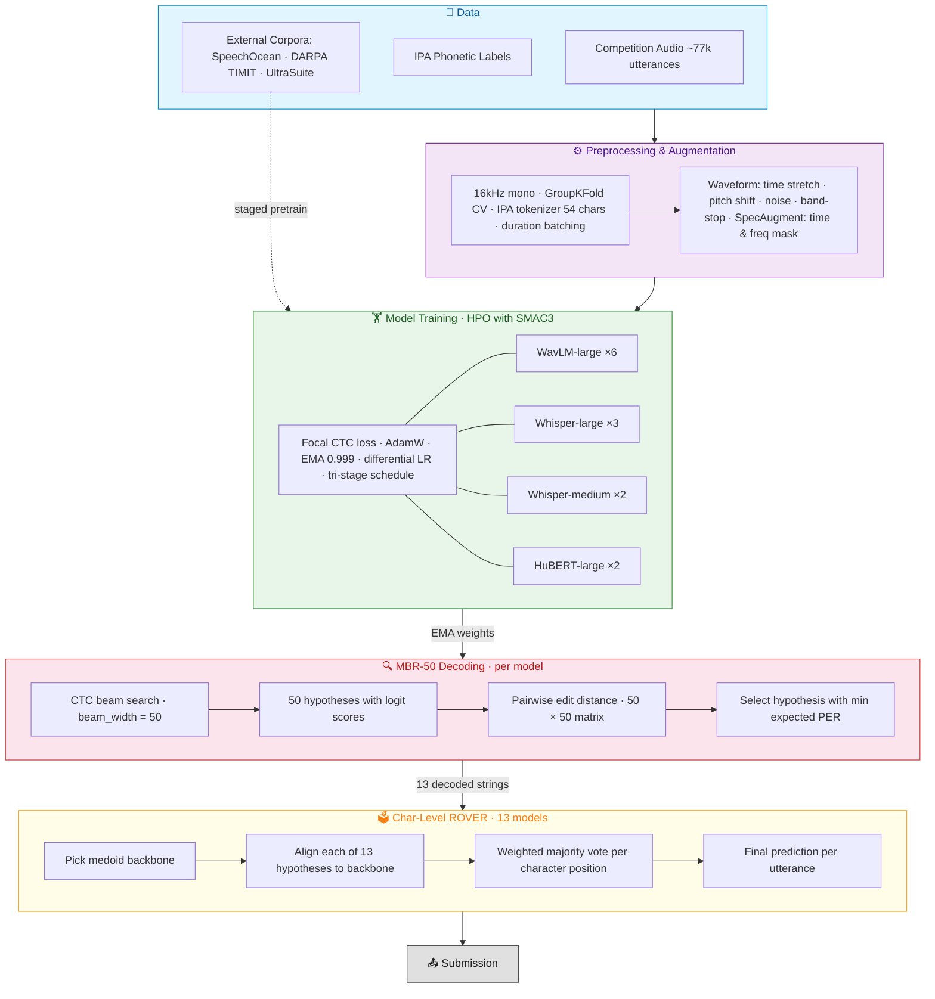

# On Top of Pasketti: Children's Speech Recognition Challenge - Phonetic Track — 2nd Place Solution 🥈

Team Epoch's competition solution for the [DrivenData Speech Phonetic Transcription Challenge](https://www.drivendata.org/competitions/309/childrens-phonetic-asr/leaderboard) hosted by the [Gates Foundation](https://www.gatesfoundation.org), achieving **second place** and a $15000 prize with a phoneme error rate (PER) of **0.2607** on the private leaderboard.

## Approach

Transcribing verbatim children's speech cannot rely heavily on language models — children produce disfluencies, non-standard pronunciations, and incomplete words that break conventional ASR assumptions. We decided to stay very close to the acoustics by using CTC-based models, which make frame-level predictions without any language model dependency. To compensate for the lack of a language model, we invest heavily in model diversity and ensembling. Our pipeline consists of three stages:

### 1. CTC Models (5 architecture families)

We train multiple CTC-based speech recognition models that predict IPA phoneme sequences from audio:

| Architecture | Backbone | # Models | Individual MBR-50 PER |
|---|---|---|---|
| **WavLM-large** | `microsoft/wavlm-large` | 6 | 0.236 — 0.239 |
| **Whisper-large** | `openai/whisper-large-v3` | 3 | 0.246 — 0.247 |
| **Whisper-medium** | `openai/whisper-medium` | 2 | 0.253 — 0.255 |
| **HuBERT-large** | `facebook/hubert-large-ll60k` | 2 | 0.247 — 0.248 |

All models use a 2-layer CTC head on top of frozen-then-finetuned SSL/Whisper encoder features, with EMA weight averaging. Training uses SpecAugment, waveform augmentation (time stretch, pitch shift, band-stop filter), and duration-based batch sampling of 30 seconds. Preprocessing only consisted of converting all audio samples to 16kHz and mono. We swept over a selection of hyperparameters with a W&B- or SMAC3 sweep. The number of epochs ranged from 12-20 depending on overfit speed/risk.

The CTC head architecture:
```
Linear(hidden_size, hidden_size)
→ GELU
→ LayerNorm(hidden_size)
→ Dropout(classifier_dropout)
→ Linear(hidden_size, vocab_size)    # 54 IPA tokens
```

The models were trained on a train/val split of 80/20, grouped on `child_id`. This correlated strongly with LB scores, with the R2-correlation being around 0.95 for all our submissions. A full 5-fold CV was not done due to excessive runtime. Finally, two of the WavLM-large models are trained on all available data (no validation holdout) for the final submission. 

### 2. MBR Decoding (per model)

Instead of greedy or standard beam search decoding, we use **Minimum Bayes Risk (MBR) decoding** with beam width 50:

1. Generate 50 hypotheses via CTC beam search (pyctcdecode)
2. Compute pairwise edit distances between all hypotheses
3. Select the hypothesis with minimum expected character error rate under the approximate posterior

MBR consistently improves over greedy by 0.001–0.003 PER per model.

### 3. Character-Level ROVER Ensemble

We combine all 13 MBR-decoded predictions using a character-level ROVER (Recognizer Output Voting Error Reduction) algorithm:

1. **Backbone selection**: pick the medoid hypothesis (minimum total edit distance to all others)
2. **Independent alignment**: align each other hypothesis to the backbone via edit distance
3. **Weighted voting**: at each character position, vote with optional per-model weights
4. **Insertion handling**: include inserted characters only if strict majority votes for them

Architecture diversity is the single biggest lever; adding whisper and HuBERT models to a WavLM-only ensemble reduced PER from 0.2364 to 0.2259.

### Pipeline Overview



## Key Results

### Progression of improvements

| Stage | Val PER | Public LB PER | Technique |
|---|---|---|---|
| Wav2Vec2 base LoRA, greedy decoding | 0.3539 | 0.3703 | Initial CTC baseline |
| + WavLM base LoRA + beam search | 0.3389 | 0.3658 | Beam width 15 + waveform augmentation |
| + WavLM-large LoRA with LLA | 0.2800 | 0.3244 | Increased model size + Learned Layer Aggregation |
| + Full fine-tuning, greedy | 0.2610 | 0.3062 | WavLM-large, replacing LoRA |
| + EMA, duration batching, diff. LR, tri-stage sched. | 0.2515 | 0.2918 | Training improvements + Whisper-large-v3 instead |
| + HuBERT-large | 0.2499 | 0.2871 | HuBERT after SSL pretraining |
| + Logit-level ensemble | 0.2460 | 0.2851 | HuBERT + Whisper with temperature and blank penalty scaling |
| + Focal CTC loss (WavLM-large) | 0.2466 | 0.2776 | Down-weights well-classified frames |
| + Majority voting ensemble | 0.2353 | 0.2734 | Two best WavLM + best Whisper |
| Best single model (greedy) | 0.2376 | 0.2766 | WavLM-large CTC |
| + MBR-50 decoding (single model) | 0.2363 | | Beam search + MBR selection |
| + 5-model greedy ROVER (WavLM only) | 0.2364 | | Char-level voting, but same-architecture = low diversity |
| + 8-model greedy ROVER | 0.2298 | | Added whisper + HuBERT — diversity is key |
| + 8-model MBR ROVER | 0.2284 | | MBR per model before ROVER |
| + 9-model MBR ROVER | 0.2265 | 0.2613 | 4 WavLM + 3 whisp-L + 2 HuBERT |
| + 13-model MBR ROVER | 0.2259 | | 6 WavLM + 3 whisp-L + 2 whisp-M + 2 HuBERT |
| + whisper 1.5x vote if med pred ≤ 10 | 0.2258 | 0.2599 | Whisper models are specialists on short utterances |

### What didn't work

| Technique | Result | Why |
|---|---|---|
| XGBoost vowel rescoring | Overfits to specific model | CTC logit features don't transfer across models |
| Fine-tuning decoder parameters | -0.0004 at best, overfit risk | Shallow optimum, tuned on val |
| Post-processing rules (ː fixes, impossible bigrams) | Negligible | Too rare (~175 tokens in 30k utterances) |
| Logit-level ensemble (averaging logits) | +0.1 PER (much worse) | Calibration mismatch across models |
| TTA (speed perturbation) | Worse than ensembling independent models | Shallow diversity vs real model diversity |
| Weighted ROVER | +0.0002 at best | With balanced architecture representation, equal weights are near-optimal |
| KenLM N-gram rescoring | -0.04 local, no difference LB | Likely overfitting on local data, as the language model was made on the local corpus |
| LoRA fine-tuning | Full fine-tuning outperformed LoRA by ~0.02 PER | Not enough capacity to capture the acoustic variation in children's speech. LLA helped close the gap but not enough |
| Learned Layer Aggregation (LLA) | Helped with LoRA, no benefit with full fine-tuning | LLA learns weighted combinations across encoder layers — useful when certain layers specialize in phonetics. With full fine-tuning, all layers adapt freely, making LLA redundant |

### Other things we tried
We tried a lot of different things too, but did not have conclusive proof of their effectiveness. Here is a list of these ideas:

- **External datasets**: These included pretraining on non-banned external datasets, which failed due to lack of decent quality data. 

- **SSL pretraining**: We tried to integrate the data from the word track into our pipeline in two different approaches. The first one was to try and use reconstruction-SSL on this to pre-tune the WavLM's and HuBERT's to children speech. This seemed to not matter much, but needs more extensive testing. 

- **Multi Task Learning**: We also tried to use the word data with a MTL task; by creating a 2nd CTC head for the word labels, and using alternating batches to get an even split. While this seemed to have potential, we left it due to lack of time. 

- **More robust preprocessing**: We looked at various preprocessing approaches, like denoising and audio segmentation, but no fast and reliable enough pipeline was found before the end of the competition.  

- **LCS-CTC**: It was too hard to get a proper cost-matrix on this noisy dataset that alligns the labels with the output of allignment models. 


### Other quirks
- We found that fp16 had significantly better performance than bf16, up to a **performance boost of 0.03** running the same config on both fp16 and bf16. Due to us clipping the maximum gradient to under 10, we did not have any stability issues with an autocaster + fp16, so it turned to our default.

- The 'phonemes' we predicted the worst were the length-mark (ː), and then the glottal-stop (ʔ), with our models almost never predicting them. This would make sense as opposed to other phonemes, these two do not make a unique and consistent noise. We tried various things in post-processing to reconstruct these, but no solution worked.

- We did encounter some stability issues with the model collapsing to only predicting blanks at some point in the training loop and thus being stuck at a per of 1.0 for both train and val. We figured this was due to a slightly too high learning rate for the backbone:


## Training Features

**Architecture:**
- CTC head on top of pretrained SSL/Whisper encoder hidden states
- Optional **Learned Layer Aggregation (LLA)**: learns weighted combination across all encoder hidden layers instead of using only the last layer
- Optional **auxiliary age prediction head**: multi-task learning with age-group classification (4 classes) to regularize encoder representations
- Optional **LoRA** fine-tuning (low-rank adaptation) for parameter-efficient training

**Optimization:**
- **Differential learning rates**: separate LR for backbone (1e-6 – 5e-5) and CTC head (5e-5 – 5e-3), found via SMAC Bayesian hyperparameter optimization
- **Tri-stage LR schedule**: warmup → hold → cosine decay, with independent phase ratios for backbone and head
- AdamW optimizer with weight decay (1e-5 – 5e-2)
- **EMA (Exponential Moving Average)** with decay 0.999 — EMA weights used at inference, providing smoother and more generalizable predictions
- Mixed precision training (fp16 preferred over bf16 — up to 0.03 PER improvement)
- Gradient clipping (max norm 1.0 – 10.0)
- Optional gradient checkpointing for memory-constrained training
- **Backbone freezing**: optionally freeze encoder for the first N epochs, then unfreeze for full fine-tuning
- Early stopping on validation PER with configurable patience
- Guard clause: abort training early if PER exceeds threshold after N epochs (kills bad sweeps fast)

**Loss functions:**
- Standard CTC loss with batch-level reduction
- CTC loss with length-normalized reduction (divides by target length)
- **Focal CTC loss** (gamma=0.1–0.6): down-weights well-classified frames, focusing on hard examples

**Data & augmentation:**
- **Training data**: competition phonetic transcripts + TalkBank external data
- **Staged pretraining** on external corpora (SpeechOcean, DARPA TIMIT, UltraSuite) before main training
- **GroupKFold cross-validation** by child_id (no child leakage between train/val)
- **Duration-based batch sampling**: groups similar-length utterances to minimize padding waste
- **Waveform augmentations** (applied on-the-fly during training):
  - Time stretch (0.8x – 1.2x speed)
  - Pitch shift (-4 to +3 semitones)
  - Band-stop filter (200 – 4000 Hz)
  - White noise injection
  - Background noise mixing (mixing in other samples, SNR 5–10 dB)
- **SpecAugment** (applied in model forward pass):
  - Time masking (prob 0.05 – 0.10, length 10 frames)
  - Frequency masking (prob 0.0 – 0.05, length 10 bins)
- Configurable augmentation intensity: `high`, `low`, `none` presets
- **Train on all data** mode: skip CV split for final submission models

**Hyperparameter optimization:**
- **SMAC3** (Sequential Model-based Algorithm Configuration) for Bayesian optimization across 10+ hyperparameters
- Separate SMAC sweeps per architecture family: `smac_ssl_sweep`, `smac_ssl_sweep_v2`, `smac_whisper_sweep`, `hubert_large_sweep_ssl`
- W&B integration for experiment tracking and sweep coordination
- ~400 total runs evaluated across all sweeps

## Setup

1. Install the prerequisites
     - Python version 3.11
     - Astrals's uv

2. Install the required python packages in the pyproject.toml file using ``uv sync``.

3. Put all the drivendata + talkbank under the data/audio folder, and the jsonl files under the data/, named ``train_phon_transcripts.jsonl`` and ``train_phon_transcripts_talkback.jsonl`` respectively.

4. If you want to do inference on new data, you would need to put the audio files under the data/audio folder, have the metadata be in a file named ``utterence_metadata.jsonl``, and also have a ``submission_format.json`` file similar to that provided by the competition. 

## Hardware

The solution was run on different workstations with a range of the following specs:
- CPU: Ryzen 9 7950x, Threadripper pro 3945WX, Threadripper pro 5955WX, Threadripper pro 7965WX
- RAM: 96 - 128 GB DDR4/5
- GPU: Quadro RTX 6000 24gb, RTX A5000 24gb, RTX A6000 48gb

A GPU with at least 24gb VRAM and at least 32gb RAM is needed for training.

Training time ranged from 5 hours for the whisper-medium on the best GPU to 12 hours for the Wavlm-large on the worst GPU, provided the data is preprocessed to .npy files.

Inference time: The ensemble of 13 models just fit within 2 hour inference time limit. Each model itself took around 9 minutes to make predictions on the test set. This could have been furter optimized by running the preprocessing on the test-set, but was not done. 

## Project Structure

```
speech_phonetic_track/
├── configs/                     # Hydra configuration
│   ├── default.yaml             # Base config
│   ├── experiments/             # Per-run configs (copied from .hydra/)
│   ├── model/                   # Model architecture configs
│   ├── augmentation/            # Augmentation configs
│   ├── decoder/                 # Decoder configs (greedy, beam, MBR)
│   ├── final_submission/        # The 13 configs of the models trained for the final submission.
│   └── ...
|   data/
|   ├── audio/                   # .flac files from the competition
|   ├── noise/                   # self crafted background noise for augmentations
├── src/
│   ├── preprocessing/
│   │   ├── dataset.py           # Wav2Vec2Dataset, WhisperDataset, data loaders
│   │   ├── phoneme_tokenizer.py # IPA character-level tokenizer (54 tokens)
│   │   ├── augmenations.py      # Waveform augmentation pipeline
│   │   └── ...
│   ├── train/
│   │   └── train_CTC.py         # Training loop with EMA, SpecAugment, early stopping
│   ├── utils/
│   │   ├── models.py            # WhisperCTC, Wav2Vec2CTC model classes
│   │   ├── decoder.py           # GreedyDecoder, BeamSearchDecoder, MBRDecoder
│   │   ├── score.py             # IPA-PER scoring 
│   │   └── ...
│   ├── optimize_decoder/
│   │   ├── rover.py             # ROVER ensemble strategies
│   │   ├── ensemble_experiments.py  # Weighting & ablation experiments
│   │   ├── error_breakdown.py   # S/D/I error analysis
│   │   └── ...
│   ├── vowel_rescoring/         # XGBoost phoneme pair rescoring (experimental)
│   ├── eval.py                  # Standalone evaluation with optional logit saving
│   └── mbr_eval.py              # MBR decoding + parquet saving for all runs
├── run_inference.py             # Competition inference: MBR + ROVER ensemble
├── pack_submission.sh           # Pack submission zip
└── pyproject.toml
```

## Usage

### Preprocessing

```bash
# audio will be preprocessed to 16k and mono, and converted to .npy for quicker reading time
uv run src/preprocessing/preprocess_audio.py

# creating the noise samples (needed for some of the final configs)
uv run src/preprocessing/create_noise_samples.py
```

### Training

```bash
# Standard training with default config (wavlm-base-plus)
uv run src/run_pipeline.py 

# Train one of final models
uv run src/run_pipeline.py --config-dir configs/final_submission --config-name wavlmLarge1
# Where the config name is one of hubertLarge, wavlmAlldata, wavlmLarge, whisperLarge, whisperMedium, alongside a number (1-4). 

# You might need to pass logging.use_wandb=false if it doesnt work. 
```

### MBR Decoding (local testing)

```bash
# Decode all configured runs
uv run src/mbr_eval.py

# Decode specific runs by name suffix
uv run src/mbr_eval.py 252 367
```

### ROVER Ensemble Evaluation (local testing)

```bash
# Edit RUN_PARQUETS in rover.py, then:
uv run src/optimize_decoder/rover.py
```

### Inference code:
```bash
# Change all the model paths in the output_paths variable you want to use
uv run run_inference.py

# If it fails due to missing local weights, run the bash pack_submission.sh first, and then rerun it. 

# This pipeline can also be used to make predictions on new files, provided the utterence metadata and submission format jsonl's exist. 
```

### Competition Submission

```bash
# First, any missing package wheels in the runtime is downloaded (pyctcdecode, hydra, etc.) under offline_wheels/
uv run src/inference/download_wheels.py


# Then the submission zip is made, where the model weights, code and packages are automatically packed
bash pack_submission.sh
```
